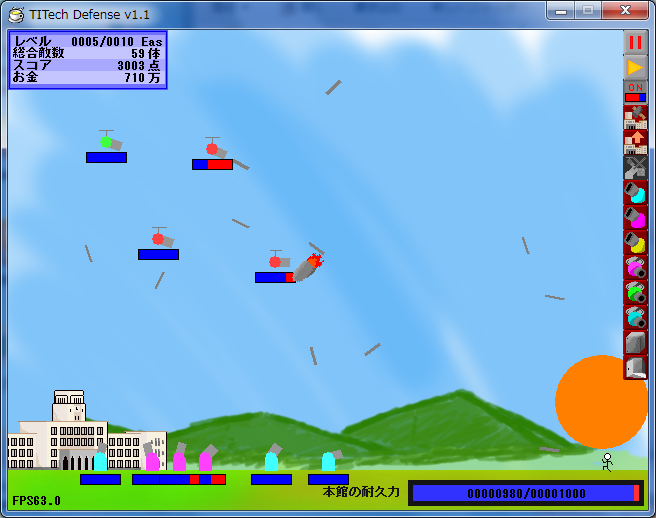
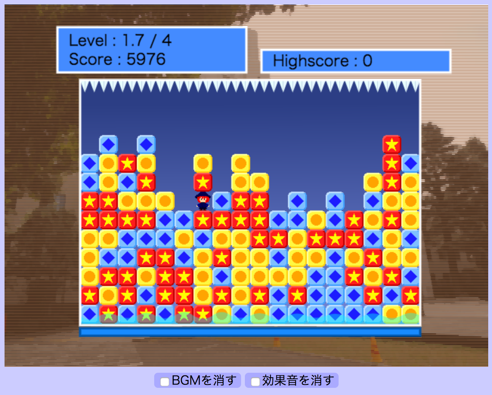
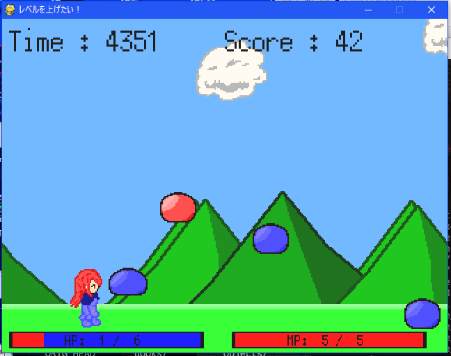

## 開発環境

言語:
- Python
  - 競技プログラミング
  - Webアプリ開発
  - ゲーム開発
- C/C++
  - 競技プログラミング
  - ゲーム開発
- JavaScript
  - Webアプリ開発 (Node.js [CoffeeScript, pug, less])
- Ruby
  - Webアプリ開発 (Ruby on Rails)
- Java
  - Androidアプリ開発

エディタ:  
- Vim
- Android Studio

## 成果物一覧

### == ゲーム制作 ==

#### "TITech Defense"
  
2012年工大祭展示  
ジャンル: 防衛ゲーム  
言語: HSP  
Download: [OneDrive](https://onedrive.live.com/?id=A8BFF073B71E297E%21107&cid=A8BFF073B71E297E)

#### "数陣Titech"
2013年工大祭展示  
ジャンル： パズルゲーム  
言語: C++ (DirectX9)

#### "繋ぎ消しパズル"
  
2014年工大祭展示  
ジャンル: パズルゲーム  
言語: JavaScript(HTML5, Node.js)  
Play: [web page](http://smijake3.s602.xrea.com/game/rogy/kodaisai14/)  
Source: [GitHub](https://github.com/tjkendev/blockgame-2014)

#### "レベルを上げたい！"
  
2015年工大祭展示  
ジャンル: アクションゲーム  
言語: Python(pygame)

### == そのほか ==

#### Webアプリ: Graham Scan可視化  
言語: JavaScript(HTML5, Node.js)  
Link: [web page](http://smijake3.s602.xrea.com/tips/algorithm/graham_scan/)  
Source: [GitHub](https://github.com/tjkendev/graham-scan)

## 競技プログラミング

AOJ: [jakenu0x5e](http://judge.u-aizu.ac.jp/onlinejudge/user.jsp?id=jakenu0x5e)  
POJ: [jakenu0x5e](http://poj.org/userstatus?user_id=jakenu0x5e)  
AtCoder: [yaketake08](https://atcoder.jp/user/yaketake08)  
Codeforces: [tjake](http://codeforces.com/profile/tjake)  
TopCoder: [tjaga](https://www.topcoder.com/members/tjaga/)  
ProjectEuler: tjake(476262_29a06495b346b288fdfe084c9b1400c5)    
  
yukicoder: [tjake](http://yukicoder.me/users/1186)  
CodeChef: [tjake](https://www.codechef.com/users/jakenu0x5e)  
HackerRank: [tjake](https://www.hackerrank.com/tjake)  
